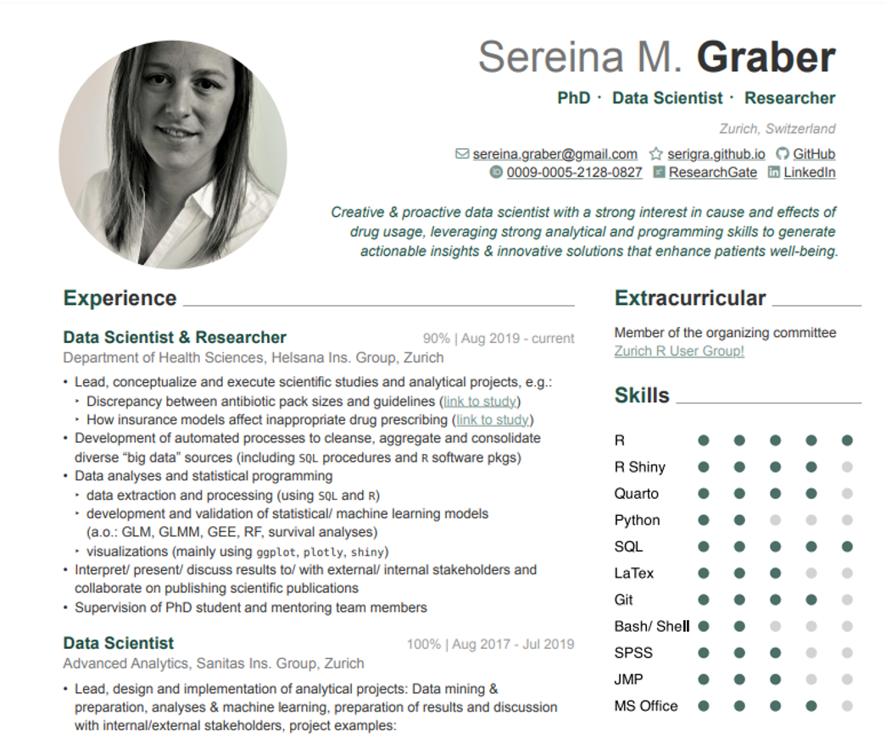

This is a CV template based on Quarto, R and Typst.

Large parts of this code are borrowed from Kazuharu Yanagimoto's [typst implementation](https://github.com/kazuyanagimoto/quarto-awesomecv-typst/blob/main/README.md),
which is again is based on Byungjin Park’s LaTex implementation ([Awesome-CV](https://github.com/posquit0/Awesome-CV)), which again is inspired by
Paul Tsouchlos’s [modern-cv](https://typst.app/universe/package/modern-cv/) in typst.

Additionally, I am very thankful for Aaron Schiffs' [explanation](https://github.com/quarto-dev/quarto-cli/discussions/10690)
on how he customized his typst format using `grid()`, which I took over for the two-column layout in my CV template.



## Installation

```bash
quarto install extension serigra/CV-Typst-Template
```

## Customization

### Content

* All the meta-data information (Name, Adress, Position, Contacts, etc.) can be set in the YAML-header of the .qmd file itself (as an example see `My_CV.qmd`).
```bash
---
title: "CV Your Name"
author:
  firstname: your first name
  lastname: your last name
  address: "Zurich, Switzerland"
  position: "PhD ・Data Scientist ・Researcher"
  summary: " Creative & proactive data scientist with a strong interest in cause and effects of drug usage, leveraging strong analytical and programming skills to generate actionable insights & innovative solutions that enhance patients well-being."
  contacts:
    - icon: fa envelope
      text: your.name@gmail.com
      url: "mailto:your.name@gmail.com"

..etc..

```
* Headers and subheaders for positions and academic career entries can be set using the typst function `#resume-entry()`.
The function is defined in `typst-template.typ` and can be used in a ` ```{=typst} `-chunk inside your .qmd file:

```{=typst}
#resume-entry(
  title: "Data Scientist & Researcher",
  date: "90% | Aug 2019 - current",
  location: "",
  description: "Department of Health Sciences, Helsana Ins. Group, Zurich",
)

```


### Skills- & Language-Level-Plot

The dot plots illustrating the levels of the corresponding skills can be created using the `skill_dots()` function, 
which is stored in the `functions.R` file. The function can be utilized as shown below, 
and placed directly in an R-code-chunk of your .qmd file generating your CV:

```r
source("functions.R")

skill_dots(skills <- c("R", "R Shiny", "Quarto", "Python", "SQL"),
           scores <- c(5, 4, 4, 2, 5) )
```

See `My_CV.qmd`.


### Layout 


The placement of content in specific columns can be controlled using 
`::: {.leftpanel}` and `::: {.rightpanel}`, which are configured in the `columns.lua` file.
For more details, please see Aaron Schiffs' [explanation](https://github.com/quarto-dev/quarto-cli/discussions/10690).

The the column widths are defined by `columns: (67%, 33%)` within `grid()` 
in the `# resume()` function in the `tpyst-template.typ`.


### Colors, Fonts and Font Sizes

These can all be defined in `tpyst-template.typ`.

