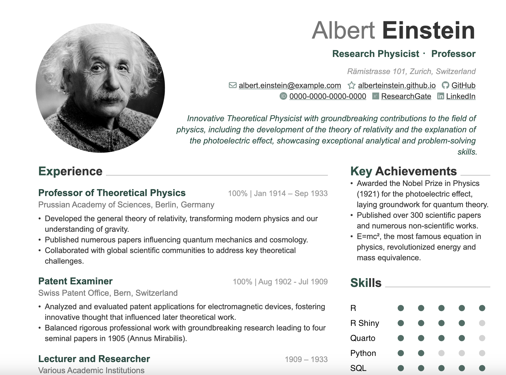

# CV template based on Quarto, R and Typst.

This is a CV template based on Quarto, R and Typst.

Large parts of this code are borrowed from Kazuharu Yanagimoto's [typst implementation](https://github.com/kazuyanagimoto/quarto-awesomecv-typst),
which again is based on Byungjin Park’s LaTex implementation ([Awesome-CV](https://github.com/posquit0/Awesome-CV)), which again is inspired by
Paul Tsouchlos’s [modern-cv](https://typst.app/universe/package/modern-cv/) in typst.

Additionally, I am very thankful for Aaron Schiffs' [explanation](https://github.com/quarto-dev/quarto-cli/discussions/10690)
on how he customized his typst format using `grid()`, which I took over for the two-column layout in my CV template.

My personal CV is available [here](https://serigra.github.io/Webpage_Quarto/about/files/CV.pdf).



## Usage & Installation

To get the whole bundle of files including the `CV_template.qmd` as well as the 
`_exensions` folder including the style files, use the following in your terminal:
```bash
quarto use template serigra/CV-Typst-Template
```


To download only the _extensions folder itself, use the following:
```bash
quarto install extension serigra/CV-Typst-Template
```

## Customization

### Content

* All the meta-data information (Name, Adress, Position, Contacts, etc.) can be set in the YAML-header of the .qmd file itself (as an example see `CV_template.qmd`).
```bash
---
title: "CV Albert Einstein"
author:
  firstname: Albert
  lastname: Einstein
  address: "Rämistrasse 101, Zurich, Switzerland"
  position: "Research Physicist ・Professor"
  summary: "Innovative Theoretical Physicist with groundbreaking contributions to the field of physics, including the development of the theory of relativity and the explanation of the photoelectric effect, showcasing exceptional analytical and problem-solving skills."
  contacts:
    - icon: fa envelope
      text: albert.einstein@example.com
      url: "mailto:albert.einstein@example.com"

..etc..

```


* You can also add a profile image via the YAML-header as follows 
(if no image is added, the header will be centered):

```bash
profile-photo: img/Foto_Albert_Einstein.jpg
```


* Headers and subheaders for positions and academic career entries can be set using the typst function `#resume-entry()`.
The function is defined in `typst-template.typ` and can be used in a ` ```{=typst} `-chunk inside your .qmd file:

```{=typst}
#resume-entry(
  title: "Professor of Theoretical Physics",
  date: "100% | Jan 1914 – Sep 1933",
  location: "",
  description: "Prussian Academy of Sciences, Berlin, Germany",
)

```


### Skills- & Language-Level-Plot

The dot plots illustrating the levels of the corresponding skills can be created using the `skill_dots()` function, 
which is stored in the `functions.R` file. The function can be utilized as shown below, 
and placed directly in an R-code-chunk of your .qmd file generating your CV:

```r
source("functions.R")

skill_dots(skills <- c("R", "R Shiny", "Quarto", "Python", "SQL"),
           scores <- c(5, 4, 4, 2, 5) )
```

See `CV_template.qmd`.


### Layout 


The placement of content in specific columns can be controlled using 
`::: {.leftpanel}` and `::: {.rightpanel}`, which are configured in the `columns.lua` file.
For more details, please see Aaron Schiffs' [explanation](https://github.com/quarto-dev/quarto-cli/discussions/10690).

The the column widths are defined by `columns: (67%, 33%)` within `grid()` 
in the `# resume()` function in the `tpyst-template.typ`.


### Colors, Fonts and Font Sizes

These can all be defined in `tpyst-template.typ`.

